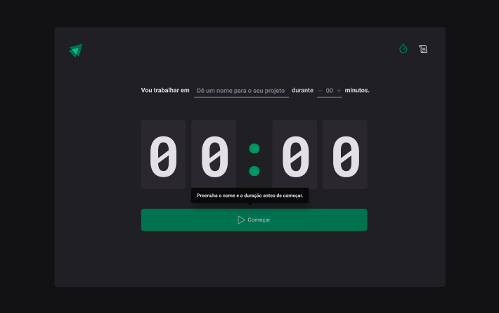
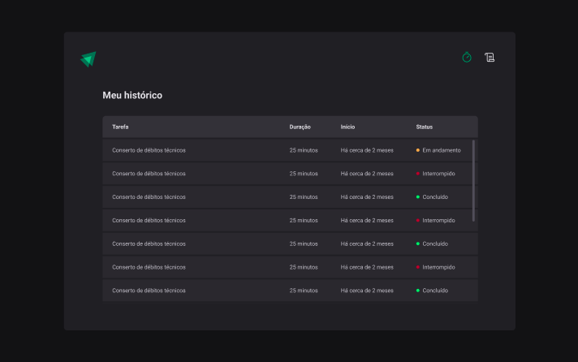

<div align="center">

  <h1>SPA com ReacJS</h1>
  <p>
    Rocketseat · Formação Ignite · 2022
  </p>

<!-- Badges -->
<p>

</p>

<h4>
    <a href="https://rs-ignite-02-timer.vercel.app/" target="_blank" >Demo</a>
  <span> · </span>
    <a href="https://www.figma.com/community/file/1127351821076435124">Figma</a>
</h4>
</div>

<br />

## 💡 Projeto

Projeto completo baseado no design definido no [figma](https://www.figma.com/community/file/1127351821076435124), usando conceitos de estados globais com context api, useReducer, immer e etc.

---

## 🎯 Objetivos

Por meio deste projeto, foi possível aprender os fundamentos do ReactJS, como:

- [x] Criar uma aplicação do zero com Vite
- [x] Prop Drilling
- [x] Estados globais
- [x] Context API
- [x] useReducer
- [x] Typescript

## 🥳 Aplicação

### Preview · [DEMO](https://rs-ignite-02-timer.vercel.app/)

<p align="center">
  
  
</p>

## 💻 Feito com

[](https://developer.mozilla.org/pt-BR/docs/Web/JavaScript)
[](https://www.typescriptlang.org/)
[](https://pt-br.reactjs.org/)
[](https://developer.mozilla.org/pt-BR/docs/Web/CSS)
[](https://vitejs.dev/)
[](https://vercel.com/)

## 🛠️ Ferramentas

[](https://www.figma.com/)
[](https://code.visualstudio.com/)
[](https://pop.system76.com/)

## 🦸‍♂️ Tecnologias de suporte

- [DateFNS](https://github.com/date-fns/date-fns#readme)
- [Immer](https://immerjs.github.io/immer/)
- [Phosphor Icons](https://phosphoricons.com/)
- [React Hook Form](https://react-hook-form.com/)
- [React Router Dom](https://reactrouter.com/en/main)
- [Zod](https://zod.dev/)
- [Styled Components](https://styled-components.com/)

## 🚀 Execute o projeto

Clone o projeto

Vá para a raiz do diretório

Instale as dependências

```bash
  pnpm install
```

Inicie o ambiente de desenvolvimento

```bash
  pnpm run dev
```

<p align="center">Copyright 2022 ☕<a href="https://github.com/laripeanuts"> laripeanuts</a></p>
